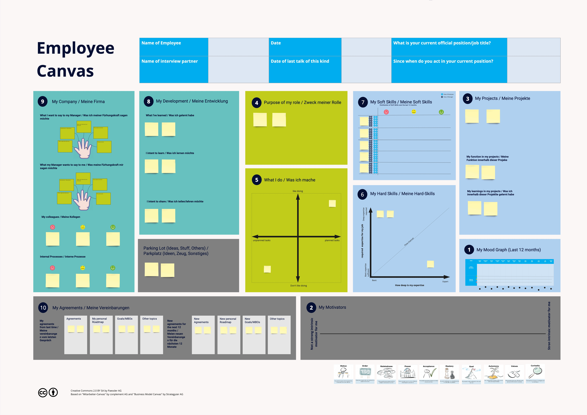
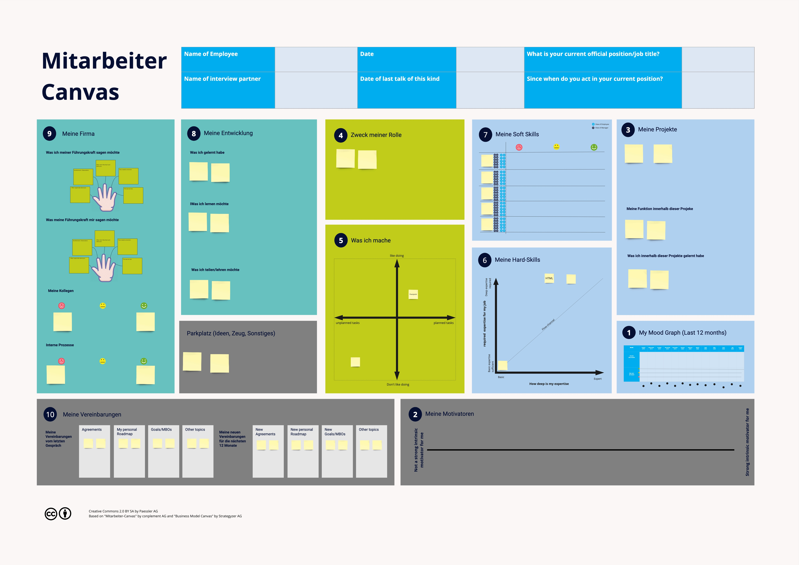

# Employee Canvas (Mitarbeiter Canvas)

# What is the Employee Canvas?
The Canvas can be used digitally on Miro, printed in DIN A0 or just drawn on a big brown paper.

# What is the purpose of an employee canvas?
The employee canvas should be shared between both participants:

- It gives an overall view of the position of the employee in the company
- It enables a face to face conversation which:
  - does not focus on the evaluation of the employee by the manager
  - is more appreciative, since it focus on the people, their talents and their contribution

# How does the Employee Canvas work?
- The basic idea is that, you can discuss better about your own job not only by looking at your actual job, but also considering what your role, in customer projects, is, for and how the company can support that internally. So you look at the employee's role in holistically.
- To visualize this holistic view, both participants in the conversation use a large poster as a kind of "map" or "workspace" as a guide. This poster is called a "Canvas."
- The canvas is filled with Post-It by both conversation participants in real time during the conversation. In this way, both participants have the holistic view and can sharpen the individual aspects as desired during the conversation.
- The idea was inspired by the "Business Model Canvas" from Strategyzer AG, which can be used to visualize business models holistically. We have simply adapted this concept.

# How is the employee canvas structured?
The Canvas has four areas:
- In the center (yellow) is the employee with his or her activities or role.
- The foundation (green) is what is brought from agreements from the previous year's interview (e.g. personal roadmap) and what is currently driving/motivating the employee.
- On the right (blue) is the external view to customers and projects. Here it is recorded in which projects and project roles the employee was/is active and which technical competencies and soft skills he/she uses for this.
- On the left (orange) is the view inwards into the company. Here it is noted how the organization supports that one can work successfully outward.
- There is room here for feedback on managers and colleagues, for example, or for training topics.

----

# How to do a employee review using the Employee Canvas?
The full guide on how to use the Canvas in a conversation is TODO and hopefully available here, soon.
Until now, you can refer to the (German) guide of conplement AG, where the first version of the Employee Canvas was developed.

# Contents of this project
- EmployeeCanvas-OpenSourceShare.rtb: A backup of the Canvas in DE and EN that can be imported in Miro

# Video of Keynote
Doris and Udo shared the Employee Canvas as Keynote at the conference Manage Agile in Berlin in 2018.
The video (in German) is probably a good starting point for exploring the Employee Canvas.
<a href="https://youtu.be/pdGJI9Q6JSw">The Keynote on YouTubey</a>

# Copyright
Creative Commons 2.0 BY SA by Paessler AG
Based on "Mitarbeiter-Canvas" by conplement AG and "Business Model Canvas" by Strategyzer AG
Employee Canvas was originally developed by Udo Wiegärtner and Doris Dietz
